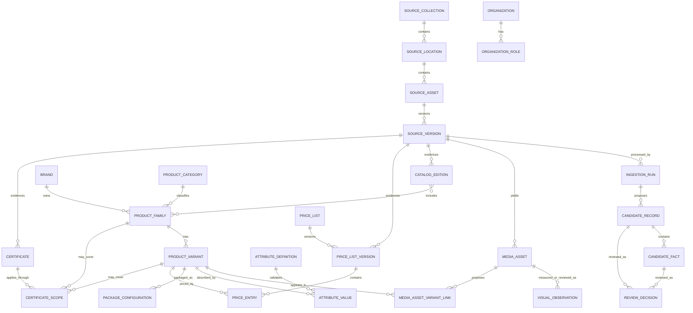

# Tile Concept OS - Canonical Merchandise Schema

> **Repository snapshot.** This is a dated copy of the canonical document in the
> Obsidian Build Vault (`5. Idea Vault/1. Internal Application/Tiles Concept - Backend
> Management/`), taken at the **2026-08-21 corpus cutoff**. Product decisions are
> still made in the vault; this copy exists so the schema, the import tooling, and
> the reasoning behind them live next to the code that implements them.
>
> The discovery corpus itself (`Discovery Corpus/_local`, ~3.1 GB of supplier
> originals, extractions, and provisional records) is **not** in this repository and
> never will be. It stays on the operator's machine, Git-ignored, and reaches
> Supabase only through `scripts/corpus/` — see
> [Corpus Compatibility Map](./Corpus%20Compatibility%20Map.md).

## Modeling rules

1. Keep source organization separate from merchandise meaning.
2. Keep brand, manufacturer, supplier, and distributor as distinct organization roles.
3. Model a sellable size/color/finish combination as a product variant or SKU, not as a flattened catalog row with repeated product-family text.
4. Store every measurement and price with an explicit unit or basis.
5. Treat price, specification, and certificate validity as versioned facts.
6. Retain raw source labels and values; normalization must be reversible and traceable.
7. Use stable typed columns for cross-category search plus validated, versioned attribute definitions for category-specific fields.
8. Never use folder names, OCR output, or an LLM response as approved truth without review.
9. Keep visual evidence, machine measurements, supplier-stated specifications, and approved product attributes separate.
10. Never infer physical dimensions from image scale. Dimensions require supplier text, a technical drawing, structured source data, or human confirmation.

## Object map

## Source and ingestion objects

### `source_collection`

Represents the three observed operational roots without pretending they are product categories.

| Field | Type | Notes |
| --- | --- | --- |
| `id` | uuid | Internal stable ID |
| `code` | text | For example `deco_tiles`, `base_tiles_oem`, `base_tiles_local` |
| `name` | text | Display label from the accepted business taxonomy |
| `supply_model` | enum nullable | `local`, `oem`, `imported`, `unknown`; only after business validation |
| `drive_folder_id` | text | Stable Drive folder ID |
| `status` | enum | `active`, `inactive`, `archived` |

### `source_location`

A folder, link manifest, external catalog root, or other address from which source assets are discovered.

Key fields: `id`, `source_collection_id`, `parent_id`, `provider`, `external_id`, `display_path`, `location_type`, `brand_hint_id`, `web_url`, `access_state`, `last_scanned_at`.

### `source_asset`

Logical source identity, normally one Google Drive file ID or external URL.

Key fields: `id`, `source_location_id`, `provider`, `external_id`, `asset_class`, `name`, `mime_type`, `web_url`, `current_version_id`, `status`.

`asset_class` values: `catalog`, `price_list`, `certificate`, `technical_sheet`, `link_manifest`, `product_image`, `other`.

### `source_version`

Immutable version of a source asset.

Key fields: `id`, `source_asset_id`, `provider_revision_id`, `content_checksum`, `size_bytes`, `modified_at_source`, `discovered_at`, `snapshot_object_path`, `snapshot_state`, `parser_hint`, `supersedes_version_id`.

Uniqueness should prevent duplicate ingestion of the same `source_asset_id + content_checksum`.

### `ingestion_run`

One attempt to classify, extract, map, and validate a source version.

Key fields: `id`, `source_version_id`, `pipeline_version`, `parser_name`, `parser_version`, `started_at`, `completed_at`, `status`, `warning_count`, `error_code`, `error_detail_safe`, `raw_extraction_path`.

Statuses: `queued`, `processing`, `awaiting_review`, `completed`, `failed_retryable`, `failed_terminal`, `cancelled`.

### `candidate_fact`

One proposed normalized fact before publication.

Key fields: `id`, `candidate_record_id`, `field_path`, `raw_label`, `raw_value`, `normalized_value_json`, `source_page`, `source_region_json`, `confidence`, `validation_state`, `mapping_rule_version`.

### `candidate_record`

Groups facts that came from one coherent source row, page card, repeated block, or document-level certificate. The corpus showed that reviewing isolated facts is insufficient when product code, size, package, status, and several price tiers belong to the same row.

Key fields: `id`, `ingestion_run_id`, `candidate_record_type`, `candidate_record_key`, `source_locator_json`, `raw_group_reference`, `group_confidence`, `validation_state`, `review_state`.

Candidate record types initially include `catalog_edition`, `product_family`, `product_variant`, `price_entry`, `certificate`, and `commercial_amount_observation`. A commercial amount observation is retained evidence, not a publishable price.

### `review_decision`

Append-only decision over a candidate, record, or import group.

Key fields: `id`, `review_target_type`, `review_target_id`, `decision`, `corrected_value_json`, `reason`, `reviewed_by`, `reviewed_at`.

Decisions: `approved`, `corrected`, `rejected`, `deferred`, `superseded`.

## Visual evidence objects

### `media_asset`

One source PDF, standalone supplier image, rendered page, or approved crop. Source originals and derived images are separate records connected through `parent_media_asset_id`.

Key fields: `id`, `source_version_id`, `parent_media_asset_id`, `asset_kind`, `object_path`, `content_checksum`, `mime_type`, `size_bytes`, `width_px`, `height_px`, `page_number`, `region_json`, `document_class`, `usage_rights_state`, `review_state`.

Initial `asset_kind` values: `source_pdf`, `standalone_image`, `pdf_page_render`, `product_crop`, `room_scene`, `swatch`, `technical_drawing`, `certificate_page`, `other`.

`page_number` and `region_json` are evidence locators, not product attributes. A derived crop must retain its parent page/image and pipeline version so the original context remains recoverable.

### `visual_observation`

An append-only observation about one media asset or region. It does not directly update a product variant.

Key fields: `id`, `media_asset_id`, `observation_scope`, `observation_type`, `observation_basis`, `value_json`, `source_text_raw`, `model_or_rule_version`, `confidence`, `review_state`, `reviewed_by`, `reviewed_at`.

`observation_basis` distinguishes:

- `pixel_measurement`: palette, brightness, saturation, edge density, or another reproducible image statistic;
- `ocr_or_supplier_text`: a size, finish, color name, code, or claim explicitly printed by the supplier;
- `machine_visual_classification`: proposed color family, pattern, texture, shape, scene, or swatch classification;
- `human_visual_review`: a reviewer-confirmed visual description.

Useful initial semantic observation types include `product_region`, `scene_or_swatch`, `color_family`, `pattern`, `texture`, `finish`, `shape`, `application_context`, and `visual_distinctiveness`. Pixel palette is not an approved product color; a photographed room or page background can dominate it.

### `media_asset_variant_link`

Candidate or approved connection between an image/page/region and a product variant.

Key fields: `id`, `media_asset_id`, `product_variant_id`, `source_code_raw`, `link_basis`, `source_region_json`, `confidence`, `review_state`, `reviewed_by`, `reviewed_at`.

Initial `link_basis` values: `exact_supplier_code`, `exact_ocr_code`, `same_catalog_page`, `same_source_document`, `manual_match`. A same-document link is discovery context only and must not be published as a product-image match without a tighter page/region or human decision.

### Visual publication gate

An image becomes `product_media` only when:

- the exact family or variant is resolved;
- the crop/page locator is retained;
- internal display and storage rights are accepted;
- semantic descriptions needed for search or accessibility are reviewed;
- supplier-stated specifications remain sourced separately from visual interpretation;
- any dimension came from explicit evidence, never from pixel scale.

## Parties and commercial relationships

### `organization`

Canonical legal or commercial entity. Key fields: `id`, `canonical_name`, `registration_name`, `country_code`, `website`, `status`.

### `brand`

Customer-facing product brand. Key fields: `id`, `canonical_name`, `slug`, `owner_organization_id`, `country_code`, `status`.

### `organization_role`

Relates an organization to a brand or merchandise scope with a dated role such as `manufacturer`, `supplier`, `distributor`, `importer`, or `certificate_holder`.

This prevents `White Horse` or any other folder name from being forced to mean both brand and supplier.

## Merchandise objects

### `product_category`

Key fields: `id`, `parent_id`, `code`, `name`, `schema_version`, `status`.

Initial categories can include `tile`, `cut_tile`, `mosaic`, `wall_panel`, `finishing_product`, and `accessory`. `Base Tiles (LOCAL)` and `Base Tiles (OEM)` are not categories.

### `product_family`

A named model, collection, or series that groups sellable variants.

| Field | Type | Notes |
| --- | --- | --- |
| `id` | uuid | Internal ID |
| `brand_id` | uuid | Required |
| `category_id` | uuid | Required |
| `canonical_name` | text | Human-readable family/model name |
| `series_name` | text nullable | Preserve when distinct from canonical name |
| `description` | text nullable | Reviewed text only |
| `material_code` | text nullable | Controlled vocabulary where possible |
| `status` | enum | `draft`, `active`, `discontinued`, `archived` |
| `published_version` | integer | Optimistic/version history support |

### `product_variant`

The quoteable or stock-mappable configuration.

Key fields: `id`, `product_family_id`, `canonical_sku`, `supplier_code`, `manufacturer_code`, `variant_name`, `color_code`, `finish_code`, `grade_code`, `selling_uom_id`, `purchase_uom_id`, `status`.

Codes are scoped. Do not assume a supplier code is globally unique without brand/supplier context.

### `product_status_history`

Stores dated, source-backed lifecycle observations such as active, phased out, failed quality/status checks, discontinued, or unknown. The current published `product_variant.status` is derived from reviewed history rather than overwritten directly by an import.

Key fields: `id`, `product_variant_id`, `status_code`, `status_raw`, `effective_from`, `effective_to`, `source_version_id`, `source_locator_json`, `review_state`, `supersedes_id`.

### `product_alias`

Supports old codes, catalog labels, abbreviations, and search terms. Key fields: `id`, `target_type`, `target_id`, `alias_type`, `alias_value`, `organization_id`, `valid_from`, `valid_to`, `source_version_id`.

### `attribute_definition`

Versioned category rule. Key fields: `id`, `category_id`, `code`, `label`, `data_type`, `unit_dimension`, `allowed_values_json`, `required_state`, `comparable`, `schema_version`, `status`.

### `attribute_value`

Validated value for a family or variant. Key fields: `id`, `target_type`, `target_id`, `attribute_definition_id`, typed value fields, `uom_id`, `source_version_id`, `review_state`, `valid_from`, `valid_to`.

Use typed value columns or constrained JSON according to the implementation decision; do not store unvalidated arbitrary JSON as the only product specification model.

### `unit_of_measure`

Key fields: `id`, `code`, `name`, `dimension`, `symbol`, `decimal_scale`, `status`.

Examples: `mm`, `m`, `piece`, `sheet`, `carton`, `sqm`, `set`.

### `package_configuration`

Key fields: `id`, `product_variant_id`, `package_uom_id`, `base_uom_id`, `quantity_per_package`, `coverage_sqm`, `gross_weight_kg`, `effective_from`, `effective_to`, `source_version_id`, `review_state`.

Conversions are variant-specific where required. Never infer that one carton has the same quantity or coverage as another product.

### `product_media`

Key fields: `id`, `target_type`, `target_id`, `media_asset_id`, `media_type`, `sort_order`, `usage_rights_state`, `review_state`, `alt_text`.

`product_media` is the reviewed publication mapping. `media_asset` is the immutable evidence/derivative record, and `media_asset_variant_link` is the staging relationship.

## Catalogs

### `catalog_edition`

Key fields: `id`, `brand_id`, `name`, `edition_label`, `publication_date`, `valid_from`, `valid_to`, `source_version_id`, `market`, `language`, `status`, `review_state`.

### `catalog_item`

Joins a catalog edition to a product family or variant and retains evidence coordinates.

Key fields: `id`, `catalog_edition_id`, `target_type`, `target_id`, `source_page`, `source_region_json`, `display_order`, `raw_catalog_label`.

## Pricing

### `price_list`

Logical commercial price program. Key fields: `id`, `name`, `brand_id`, `supplier_organization_id`, `market`, `currency_code`, `price_type`, `customer_tier_id`, `tax_basis`, `status`.

### `price_list_version`

Immutable issued version. Key fields: `id`, `price_list_id`, `version_label`, `effective_from`, `effective_to`, `issued_at`, `source_version_id`, `default_currency_code`, `default_price_uom_id`, `default_tax_basis`, `review_state`, `approved_by`, `approved_at`, `supersedes_version_id`.

Source-level defaults are nullable until reviewed. A row-level price entry may override them, but missing source semantics must never be filled from convention alone.

### `price_entry`

| Field | Type | Notes |
| --- | --- | --- |
| `id` | uuid | Internal ID |
| `price_list_version_id` | uuid | Required |
| `product_variant_id` | uuid | Required after mapping; unresolved rows stay in staging |
| `amount` | numeric | Never float |
| `currency_code` | char(3) | ISO currency code |
| `price_uom_id` | uuid | Piece, sheet, carton, sqm, etc. |
| `minimum_quantity` | numeric nullable | With `quantity_uom_id` |
| `quantity_uom_id` | uuid nullable | Explicit basis |
| `tax_basis` | enum | `inclusive`, `exclusive`, `not_applicable`, `unknown` |
| `source_page_or_row` | text | Evidence locator |
| `review_state` | enum | Draft/review/approved/etc. |

Do not add `current_price` to `product_variant`. A query or reviewed view determines the current approved price for an exact scope and date. Overlapping approved entries for the same variant, price list, unit basis, and quantity band require a conflict or explicit override record.

## Certificates

### `certificate`

| Field | Type | Notes |
| --- | --- | --- |
| `id` | uuid | Internal ID |
| `certificate_type` | enum/text | Controlled vocabulary after discovery |
| `certificate_number` | text nullable | As issued |
| `title` | text | Reviewed display name |
| `issuing_organization_id` | uuid nullable | Issuer/certification body |
| `holder_organization_id` | uuid nullable | Legal holder if stated |
| `standard_code` | text nullable | For example a named standard, not inferred |
| `issued_on` | date nullable | Preserve unknown |
| `expires_on` | date nullable | Preserve non-expiring/unknown distinctly |
| `validity_state` | derived enum | `valid`, `expiring`, `expired`, `not_dated`, `revoked`, `unknown` |
| `source_version_id` | uuid | Required source evidence |
| `review_state` | enum | Publication gate |

### `certificate_scope`

Certificates need explicit scope rather than inheriting the folder.

Key fields: `id`, `certificate_id`, `scope_type`, `organization_id`, `brand_id`, `product_family_id`, `product_variant_id`, `facility_text`, `scope_text_raw`, `review_state`.

Valid `scope_type` examples: `organization`, `brand`, `manufacturing_facility`, `category`, `product_family`, `product_variant`, `unknown`.

When the source does not clearly establish scope, use `unknown` and create a review exception. Do not automatically apply a brand-folder certificate to every SKU.

## Cross-cutting publication fields

Every published domain fact should expose or be able to resolve:

- `source_version_id`
- `review_state`
- `reviewed_by`
- `reviewed_at`
- `valid_from` and `valid_to` where applicable
- `created_at` and `updated_at`
- `supersedes_id` or version relationship
- `confidence` for machine-assisted extraction, not as a substitute for approval
- `workspace_id` or accepted organizational scope if the application can serve more than one business

## Minimum publishable records

### Product variant

Required before publication:

- brand;
- category;
- canonical family/model name;
- at least one scoped source code or reviewed identity;
- selling unit;
- category-required attributes;
- source version and reviewer.

### Price entry

Required before publication:

- resolved product variant;
- amount and currency;
- exact unit basis;
- price program/type and market scope;
- effective date policy;
- tax basis;
- source locator and approval.

### Certificate

Required before publication:

- certificate type/title;
- source document;
- issuer or an explicit unresolved state;
- scope or an explicit `unknown` scope exception;
- issue/expiry interpretation that preserves missing dates;
- reviewer.

## Open schema decisions

1. White Horse's real family/series/SKU structure from representative catalogs.
2. Whether product color and finish require their own controlled entities or remain controlled attributes in v1.
3. Accepted price types, customer tiers, tax basis, and market/location scopes.
4. Certificate vocabulary, expiry-warning window, and authorized reviewer.
5. Whether a supplier's code, a manufacturer's code, or an SQL Account item code is the primary operational mapping key.
6. Whether product images may be copied and displayed internally.
7. The exact category attribute rules after one representative source from every initial product category is reviewed.
8. Controlled vocabularies for visual color family, pattern, texture, finish, shape, scene/swatch type, and product-region cropping.
