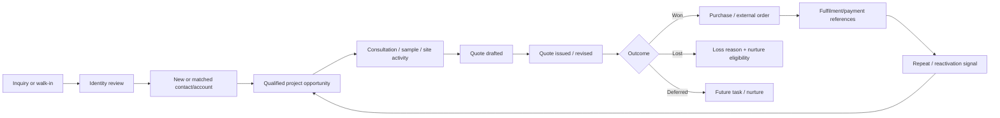
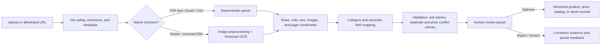
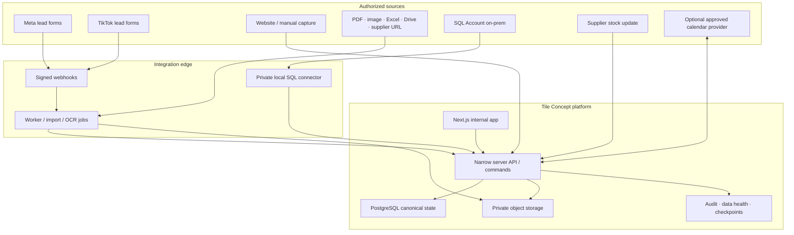

# Tile Concept OS - Product Requirements Document

## 0. Document control

| Field | Value |
| --- | --- |
| Product | Tile Concept OS, working title |
| Product type | Invite-only internal web application |
| Primary business | Contract/project sales with walk-in and repeat-purchase flows |
| Status | Proposed v1; ready for stakeholder discovery and scope approval |
| Evidence date | 2026-08-20 |
| Source register | [Source Register](<./Source Register.md>) |
| Accepted platform | GitHub source control, Vercel hosting, and Supabase backend |
| Implementation repository | A dedicated Tile Concept application repository is recommended. As of 2026-08-20, this PRD folder contains documents only and is an untracked directory inside the broader `nadeemramli/build-blog` repository; it is not an application scaffold. |
| Production-data rule | Real customer, price, supplier, credential, and stock data must not be committed to source control or copied into the Build Vault |

### Statement labels

- **Accepted input:** explicitly stated by the user or visible in supplied evidence.
- **Proposed requirement:** part of this PRD and subject to approval.
- **Discovery gate:** cannot be finalized safely until the named evidence is obtained.
- **Out of scope:** deliberately excluded from the stated release.

All performance targets in this document are proposed SLOs, not historical facts.

## 1. Executive summary

Tile Concept currently has five connected operating problems:

1. Customer inquiries arrive through multiple channels and are not resolved into one durable customer and project history.
2. Walk-in sales and purchases are keyed into Excel after the fact, separating the customer, salesperson, source, payment, and purchase from the wider sales lifecycle.
3. Product and pricing knowledge is fragmented across PDFs, screenshots, Excel files, shared-drive folders, and supplier websites, which makes quoting slow and error-prone.
4. Stock visibility differs by source: in-house wall-panel stock is represented in SQL Account/SQL Connect, while supplier stock is obtained periodically through calls or WhatsApp and is not consistently visible to the team.
5. Sales staff identify completed or nearly completed customer projects that could become testimonials, interviews, before/after content, or site shoots, but customer permission, tentative dates, crew availability, location planning, and final assets are coordinated in WhatsApp rather than a shared project-linked workflow.

The proposed product is an internal operating system with a CRM spine and a governed merchandise spine. It does not attempt to become Salesforce, an accounting ledger, a full warehouse management system, or an autonomous scraper. It creates one place to answer:

- Who is this person or company?
- Which inquiry, project, salesperson, quote, purchase, and follow-up belong together?
- What is the current opportunity stage and next action?
- Which product, code, image, dimensions, packaging, and price are approved?
- Where did that price or catalog fact come from, and when was it last reviewed?
- What stock or supplier availability is known, from which source, and how stale is it?

The first release should replace the active walk-in spreadsheet workflow and prove the lead-to-purchase lifecycle before adding broad automation.

## 2. Product thesis

### 2.1 Product promise

An authorized employee can capture any inquiry or walk-in once, resolve the identity safely, work the project sale through quote and purchase, and retrieve the customer's complete repeat history together with governed product, price, catalog, and availability evidence.

### 2.2 Product principles

1. **One authority per fact.** SQL Account remains the in-house stock and accounting authority until a separate cutover is approved. Supplier snapshots are availability evidence, not a movement ledger.
2. **Identity suggestions are reversible.** Exact or fuzzy matches may be proposed, but ambiguous people or companies are never silently merged.
3. **A lead is not a customer account.** Inquiry, person, organization, project, opportunity, quote, order, and payment are related but distinct objects.
4. **Effective dates beat overwritten values.** Prices, supplier snapshots, product specifications, and catalog versions keep history.
5. **Source and freshness are visible.** Every important operational value exposes origin, last refresh, confidence, and review state.
6. **Manual fallback is a feature.** If a platform API or supplier automation fails, staff can still capture a complete record without returning to an uncontrolled spreadsheet.
7. **AI/OCR proposes; a human publishes.** Extracted fields remain staged until reviewed.
8. **Exception first.** The home screen leads with stale stock, aging leads, overdue follow-ups, unreviewed imports, price conflicts, and sync failures.
9. **Dense, not cramped.** The system favors fast desktop operations, searchable tables, drawers, keyboard flows, and compact mobile capture.
10. **No second undocumented brain.** Transactional facts live in the app; accepted product decisions and learning live in this project folder.

## 3. Scope and outcomes

### 3.1 Product goals

| Goal | Evidence of success |
| --- | --- |
| Unify lead and customer history | A staff member can find a person/company and see linked inquiries, projects, opportunities, quotes, walk-ins, purchases, tasks, and provenance |
| Replace walk-in Excel entry | A walk-in can be resolved or registered and a purchase recorded in one guided flow; the spreadsheet is no longer the live ledger |
| Make contract sales manageable | Every active opportunity has stage, owner, project/site, estimated value, next action, due date, quote history, and loss/win reason |
| Make repeat purchase visible | A new purchase links to the existing identity and updates repeat status without destroying the original acquisition source |
| Coordinate customer-project content | Sales can nominate a suitable project, record customer media permission, propose dates, reserve marketing capacity, confirm a shoot, and attach outputs without losing the customer/project context |
| Centralize governed product knowledge | Staff can search by brand, code, name, category, color, dimensions, finish, image, or aliases and see category-relevant attributes |
| Reduce price lookup friction | A user sees the current approved price and its basis, currency, effective date, source, and history without opening multiple supplier files |
| Expose stock honestly | In-house and supplier availability appear together but retain source, location/supplier, timestamp, confidence, and stale state |
| Convert documents into reviewable records | PDF, image, Excel, CSV, and allowlisted web sources create staged extraction jobs with confidence and a human review queue |
| Preserve accountability | Material changes and merges have actor, timestamp, reason, before/after values, and external-source IDs |

### 3.2 Business metrics to baseline before targets

- Median first-response time by source and salesperson.
- Lead-to-qualified, qualified-to-quote, quote-to-won, and overall win rate.
- Median sales-cycle duration by customer type and product category.
- Opportunity and quote aging; overdue next-action rate.
- Walk-in registration completeness and time-to-complete.
- New versus existing/repeat customer purchases and repeat interval.
- Customer projects nominated for content, permission completion rate, nomination-to-confirmed-shoot time, shoot completion/postponement rate, and usable assets per completed shoot.
- Revenue or collection amount by acquisition source, customer type, salesperson, and product category, subject to finance definitions.
- Product records with approved current price and complete minimum attributes.
- Price conflicts, expired prices, and unreviewed extraction count.
- In-house stock reconciliation variance and supplier-snapshot freshness.
- Lead duplicates suggested, confirmed, rejected, and later reversed.

No target percentages are accepted until at least one representative baseline period is measured.

### 3.3 Non-goals for v1

- Replacing SQL Account as accounting, invoice, or authoritative in-house inventory system.
- Building a full Salesforce clone or generic no-code CRM platform.
- Creating a public ecommerce site or customer-facing catalog.
- Automatically scraping personal WhatsApp groups or bypassing platform permissions.
- Allowing a language model or OCR engine to publish prices, merge identities, commit stock, send messages, or mark an opportunity won without human ownership.
- Autonomous quoting, discount approval, contract signature, payment collection, or customer communication.
- Full procurement, purchase-order, manufacturing, delivery-route, installation, or warehouse-management functionality.
- Full creative production management, social publishing, ad buying, or digital-asset-management replacement; the initial shoot module coordinates opportunity, permission, booking, outputs, and handoff.
- Cross-supplier price optimization or margin advice until landed-cost and commercial rules are accepted.
- Copying EFFEN source code or proprietary assets without confirmed reuse rights.

## 4. Users, roles, and permissions

### 4.1 Primary users

| Persona | Jobs to be done |
| --- | --- |
| Sales representative | Capture inquiries and walk-ins, qualify, manage tasks, create projects/opportunities, prepare quote context, record outcomes and purchases |
| Sales manager | Assign leads, inspect pipeline, review aging, approve merges or sensitive changes, coach follow-up, analyze conversion |
| Showroom/walk-in staff | Find or register a customer quickly, capture visit and purchase details, connect the transaction to a salesperson and source |
| Marketing coordinator/content producer | Review projects nominated by Sales, validate permission and readiness, place tentative holds, assign crew, confirm or reschedule shoots, and attach resulting assets |
| Catalog/pricing operator | Import supplier materials, normalize products, review OCR, maintain attributes and effective-dated prices, resolve conflicts |
| Stock coordinator | Monitor SQL sync, enter supplier snapshots, verify discrepancies, mark source freshness, manage low-stock exceptions |
| Management | View cross-team pipeline, conversion, repeat behavior, product demand, stock risk, data trust, and exceptions |
| Platform administrator | Manage users, scopes, integrations, mappings, retention, audit, and data-quality rules |
| Read-only analyst | Access approved, masked reporting views without operational write permissions |

### 4.2 Proposed permission model

Permissions are action-based and optionally scoped by team, branch/location, brand, and salesperson.

| Capability | Sales rep | Sales manager | Catalog/pricing | Stock | Admin |
| --- | --- | --- | --- | --- | --- |
| View assigned leads and accounts | Yes | Yes | Limited/masked | Limited/masked | Yes |
| View all sales records | Scoped | Yes | No by default | No by default | Yes |
| Create/update lead, project, opportunity, task | Yes | Yes | No | No | Yes |
| Record walk-in/purchase | Yes | Yes | No | No | Yes |
| Confirm identity merge | No; suggest only | Yes | No | No | Yes |
| Publish product/attribute change | No | Read | Yes | Read | Yes |
| Publish price | No | Read | Yes; approval policy applies | Read | Yes |
| Publish supplier stock snapshot | Read | Read | Read | Yes | Yes |
| Configure SQL/platform connector | No | No | No | Read | Yes |
| View unmasked phone/email | Need-based | Yes | No by default | No by default | Yes |
| Export customer data | No by default | Approval | No | No | Approval |
| View audit | Own actions | Team | Catalog actions | Stock actions | All |

Marketing-coordination permissions overlay the core table:

- Sales representatives can nominate projects, propose customer windows, update customer-facing coordination for their scoped records, and view linked booking status.
- Marketing coordinators/content producers can review nominations, place internal holds, accept assignments, update checklists, record outcomes, and attach outputs within their scope.
- A designated marketing scheduler or manager confirms crew capacity, reschedules/cancels confirmed bookings, and approves conflict overrides.
- Media-permission approval and asset usability may require a separate manager/authorized reviewer even when a producer attended the shoot.

Discovery gate: confirm real staff roles, branch/location scope, price sensitivity, discount authority, and whether management should see all customer contact details.

## 5. Canonical sales model

### 5.1 Object semantics

| Object | Definition | Key rule |
| --- | --- | --- |
| Intake event | One source submission or manually captured interaction | Immutable source evidence; retries deduplicate on source ID/idempotency key |
| Lead | A prospecting/qualification work object created from one or more intake events | May exist before the true person/company is known |
| Contact | A person with governed contact points | One person may belong to multiple organizations over time |
| Account | A company, contractor, designer firm, developer, or other organization | Company registration/name and domains may aid matching |
| Project/site | The physical or commercial job for which materials are being considered | Keeps one customer with multiple renovation/construction jobs separate |
| Opportunity | A bounded sales pursuit for a project, value, product scope, and expected close | Owns stage, probability band, owner, next action, quote history, win/loss |
| Visit | A showroom or on-site interaction | Can occur before a lead, during an opportunity, or at purchase |
| Quote | A commercial proposal and its revisions | Each revision is immutable after issue; external SQL document may be linked |
| Purchase/order | A confirmed commercial transaction or external document reference | Does not overwrite the opportunity or original acquisition source |
| Activity | Call, message, email, meeting, walk-in, note, sample, site visit, or task outcome | Always has actor, time, channel, and linked object(s) |
| Content opportunity | A customer project nominated for a testimonial, interview, before/after feature, site shoot, or other marketing use | Links to the existing customer/project and records readiness, rationale, owner, permission, and proposed content types |
| Shoot booking | A tentative hold or confirmed production visit at one or more project sites | Tentative, standby, customer-confirmed, and final states remain distinct; schedule changes are audited |
| Media permission | The customer's documented permission for capture and specified marketing uses | Separate from ordinary contact consent; scope, evidence, date, restrictions, expiry, and revocation must be visible |
| Customer lifecycle state | New, active, repeat, lapsed, reactivated, or other accepted classification | Derived from governed events; not manually overwritten without reason |

### 5.2 Proposed lifecycle



### 5.3 Opportunity stages

Proposed default stages:

1. New inquiry
2. Contact attempted
3. Contacted
4. Qualified
5. Consultation / requirements
6. Sample or site activity
7. Quote preparing
8. Quote sent
9. Negotiation / revision
10. Verbal confirmation / pending document
11. Won
12. Lost
13. Deferred / nurture

Stage configuration may vary by sales motion, but reports map custom stages into stable reporting groups. Moving to `Won`, `Lost`, or `Deferred` requires an outcome date and reason. Moving an opportunity backward records a stage event and reason.

### 5.4 Walk-in fast path

The walk-in flow must not force staff through a long CRM wizard.

1. Enter or scan phone number; optionally enter email/company.
2. Show exact and possible matches with masked identifiers and relevant history.
3. Select an existing identity, create a provisional contact, or send an ambiguous case to review.
4. Record date/time, staff member, showroom/location, customer type, origin/project area, inquiry source, visit purpose, and notes.
5. Add a purchase or collection reference when applicable: ORC/external number, amount, payment methods, products if available, and source evidence.
6. Create or link the project/opportunity automatically based on explicit user choice.
7. Show the next action or mark the interaction complete.

The original spreadsheet columns remain importable, but boolean columns such as `Online Enquiry?`, `Walk in?`, and payment flags are normalized into channel and payment records rather than copied as permanent schema design.

## 6. Identity resolution

### 6.1 Match signals

| Signal | Normalization | Proposed match policy |
| --- | --- | --- |
| Phone | Country-aware E.164 plus raw value | Exact normalized phone may create a high-confidence suggestion; shared/company numbers require review |
| Email | Trimmed, case-normalized | Exact email is strong but does not prove two records are the same person if it is a generic/shared address |
| Company registration number | Canonical punctuation-free representation | Exact match is strong for account identity |
| Company name | Legal/trading-name normalization and aliases | Fuzzy candidate only unless supported by another signal |
| Person name | Unicode, whitespace, title normalization | Never sufficient for automatic merge |
| Address/project site | Structured components plus original text | Candidate signal; households/sites may have multiple people |
| Platform ID/form submission ID | Provider-specific external identifier | Exact link to source identity, not automatically to a real-world person across platforms |
| Purchase/order reference | Exact external-system identifier | Links transaction evidence; identity still follows customer fields and review rules |

### 6.2 Resolution behavior

- Preserve every source identity and raw source record with retention controls.
- Generate candidate matches with reason codes and field comparison.
- Auto-link only deterministic source retries or previously approved external-ID mappings.
- Require a human for cross-record person/account merges unless a later accepted rule explicitly allows a narrow exact-match case.
- A merge creates an immutable merge event, redirect/alias, before/after snapshot, actor, reason, and reversible unmerge procedure.
- A rejected candidate becomes negative evidence so the same poor suggestion is not repeated without new information.
- Never merge person and organization records into one entity.
- Lists mask contact data by default; reveal is permissioned and audited when appropriate.

### 6.3 Attribution rule

Keep both:

- `original_acquisition_source`: first known qualifying source for the identity/account under an accepted lookback rule.
- `opportunity_source`: source that initiated the specific sales pursuit.
- `interaction_source`: channel of each activity.
- `purchase_source`: channel or context of the transaction.

A repeat walk-in must not erase the original TikTok, Meta, website, referral, or earlier source.

## 7. Functional requirements

### 7.1 Command Centre

The landing page answers what needs attention now.

Required blocks:

- Morning brief: aging leads, overdue follow-ups, unassigned inquiries, quotes expiring, customer-project content opportunities awaiting review or permission, upcoming shoots, crew conflicts, stale supplier stock, SQL sync failures, price conflicts, and OCR review backlog.
- Pipeline scorecard: open value, stage counts, weighted band, quotes sent, won/lost, and response metrics with clear definitions.
- My work: tasks ordered by urgency and next action.
- Sales activity: recent inquiries, visits, quotes, purchases, and stage changes.
- Content schedule: customer projects nominated by Sales, permission/readiness exceptions, tentative holds, confirmed shoots, assigned crew, and the next seven days.
- Merchandise trust: products missing approved prices/attributes, catalog conflicts, stock freshness, and source coverage.
- Data health: connector status, last successful sync, unmapped rows, duplicates, and import errors.

Every metric opens a contributing-record view and shows grain, filters, source, freshness, and definition.

### 7.2 Lead and Inquiry Inbox

Required capabilities:

- Receive Meta/TikTok/webhook records where authorized.
- Create a lead manually from DM, WhatsApp, call, email, referral, or walk-in.
- Paste text into an extraction helper that proposes fields; the user reviews before save.
- Preserve form answers, campaign/form metadata, original timestamp, source ID, and consent/privacy evidence where provided.
- Detect source retries and duplicate submissions idempotently.
- Route by location, product interest, source, language, workload, or explicit manager assignment.
- Track first-response SLA, attempts, outcome, qualification, and disqualification reason.
- Saved views: New, Unassigned, My leads, No response, Follow-up due, Duplicate review, Qualified, Disqualified, All.
- Bulk assignment and export are permissioned and preview affected records.

### 7.3 Accounts, Contacts, Projects, and Opportunities

- Global search across name, phone, email, company, project/site, quote/order number, and external IDs.
- Contact 360 with masked identifiers, organization relationships, projects, opportunities, activities, purchases, products, consent, source, and provenance.
- Account 360 with contacts, customer type, projects/sites, opportunities, quote/purchase history, owner, aliases, and registration identifiers.
- Multiple projects per account/contact and multiple opportunities per project.
- Opportunity board and dense list; both use the same canonical stage state.
- Mandatory next action and due date for active opportunities after the first accepted qualification stage.
- Quote revisions, expected close, amount/currency, product interest, competitor/loss notes, and manager review.
- Timeline is append-oriented; edits create audit events rather than rewriting history invisibly.

### 7.4 Walk-ins and Purchases

- Mobile-friendly quick registration and desktop full form.
- Import mapping for the current Excel walk-in sheet with row-level validation and duplicate preview.
- Capture salesperson, visit location, customer type, origin/project area, new/existing status as derived/suggested, ORC/external number, amount, inquiry/walk-in channel, and one or more payment methods.
- Allow product-line detail where available; do not block purchase capture when only the external document and total are known.
- Link to SQL Account customer/order documents when integration data exists.
- Repeat purchase is derived from prior accepted purchase events for the resolved identity.
- Corrections require reason; amount/payment corrections are restricted and audited.

### 7.5 Product Catalog

Supported top-level categories initially:

- Wall panel
- Tile
- Cut tile
- Mosaic
- Finishing product
- Accessory
- Additional category configured by an authorized catalog operator

Common product semantics:

- Brand, supplier, product family/series, canonical name, code/SKU, aliases, category, status.
- Color, finish, material, style, images, description, applicable use, and searchable keywords.
- Dimensions with explicit unit and dimension type.
- Selling unit, purchase unit, conversion, packaging/carton configuration, MOQ, and order increment.
- Source document/page/URL, source version, review owner, effective date, and confidence.

Category-specific examples:

| Category | Proposed validated attributes |
| --- | --- |
| Mosaic | Sheet width/height, chip width/height, chip shape, pieces or sheets per carton, coverage per carton, finish |
| Wall panel | Series/profile, width, depth/thickness, length, material, clip/system, color, pieces/carton |
| Tile | Width, length, thickness, finish, edge, grade, pieces/carton, sqm/carton, shade/calibre when supplied |
| Cut tile | Parent/base tile, cut width/length, cut pattern, yield/wastage rule, service component, selling unit |
| Accessory | Compatible product/system, size, material, color, unit, pack quantity |

Implementation model: stable common columns plus versioned, category-specific attribute definitions and validated JSON values. Do not create a new physical column for every supplier label, and do not use unvalidated free-form JSON as the only product model.

Catalog screens:

- Searchable gallery and dense table with image, brand, code, name, current price, availability summary, and trust state.
- Product drawer/detail with variants, structured specs, media, current and historic prices, stock by source, supplier/catalog references, aliases, and audit.
- Side-by-side comparison for selected products using shared semantic attributes.
- Duplicate-product suggestions based on brand/code/alias/dimensions, with human confirmation.

### 7.6 Pricing

Price is a versioned fact, not a mutable field on a product.

Required model:

- Price list name and owner.
- Supplier/brand/category scope.
- Currency, market/location, customer tier or price type, tax inclusion, and unit basis.
- Product variant, amount, valid-from, valid-to, minimum quantity, and optional quantity break.
- Source artifact, page/row/cell or URL evidence, imported timestamp, review state, and approver.
- Superseded, scheduled, expired, conflicted, and current states.

Required behaviors:

- Search current approved prices without opening source files.
- Display price basis such as piece, sheet, carton, meter, or sqm.
- Prevent overlapping active prices for the same exact scope unless an authorized override records a reason.
- Never silently convert units or currencies. Conversions require explicit rates/rules and display the original.
- Detect a supplier file with a newer effective date and send proposed changes to review.
- Show differences before publishing a new price list.
- Preserve the price snapshot used by a quote or purchase even after the master price changes.
- Support member/retail/project/contract price types only after the business defines them.

Discount policy, landed cost, margin, tax, and customer-specific negotiated pricing are discovery gates rather than assumed fields.

### 7.7 Stock and Supplier Availability

The screen unifies visibility without pretending all numbers have equal authority.

#### In-house stock

- SQL Account/SQL Connect is the initial authoritative source for in-house wall-panel inventory.
- Phase 1 connector is read-only and stores normalized snapshots/checkpoints plus source references.
- Display on-hand, allocated/reserved, available, location, unit, source timestamp, and sync status only when the API exposes and the business validates those meanings.
- The app does not independently subtract a quotation. It mirrors or derives from accepted SQL Account facts after the quotation-versus-reservation discovery test.
- Reconciliation view compares SQL source values with app-linked sales/quote evidence and records discrepancies without overwriting the authority.

#### Third-party/supplier availability

- Each supplier update is a time-stamped snapshot with supplier, product/variant, available quantity or availability band, unit, expected replenishment, source channel, submitted by, and optional evidence attachment.
- Support quick entry, spreadsheet/CSV upload, copy/paste table, and mobile form.
- A WhatsApp screenshot or forwarded message may be attached as evidence; it is not automatically trusted as structured stock.
- Snapshot freshness is policy-driven per supplier. Proposed default: `fresh`, `aging`, `stale`, `unknown`; exact thresholds require owner approval.
- `Available`, `low`, `out`, `made-to-order`, `ask supplier`, and numeric quantity remain distinct values.
- New snapshots supersede display state but do not delete history.

#### Stock views

- Overview by category, brand, location/supplier, freshness, and risk.
- Product-level stock/availability history.
- Stale supplier queue and assigned weekly update task.
- SQL sync and mapping exception queue.
- Low-stock or quote-risk alerts only after units and thresholds are configured.

### 7.8 Source Library, Imports, OCR, and Web Capture

Supported source types:

- Native-text PDF
- Scanned/image PDF
- JPG/PNG image
- Excel/CSV
- Supplier webpage or direct file URL on an allowlist
- Manual entry with source attachment

Pipeline:



Requirements:

- Prefer native PDF text/table extraction before OCR.
- Tesseract is one OCR engine for printed text, not the system of record and not a complete table-understanding solution.
- Store original artifact privately, checksum, source name, received date, supplier/brand, page count, and parser version.
- Keep extracted text and page coordinates so a reviewer can compare the proposed field with the exact source region.
- Crop or associate product images without losing page/asset provenance.
- Optional LLM normalization may map supplier labels to canonical semantics, but output must include confidence, evidence, and review.
- A failed or low-confidence job goes to review; it does not silently drop rows.
- Re-importing the same checksum is idempotent; a changed document creates a new source version.
- Excel formulas are not executed. Import stored values and expose ambiguous formula-derived cells.
- Web capture uses a dedicated runtime connector with allowlists, rate limits, snapshots, terms/robots review, change detection, and selectors. Claude Code may help build or maintain a connector but is not the production scraper.
- No credentials are embedded in crawler code or browser clients.

### 7.9 Reports

Initial governed reports:

1. Sales pipeline and aging.
2. Lead source and response performance.
3. Quote conversion and revision analysis.
4. Walk-in, new/existing, purchase, and payment-channel summary.
5. Customer repeat/cohort behavior.
6. Product/brand/category demand from opportunities, quotes, and purchases.
7. Price coverage, expiry, and conflicts.
8. Stock freshness, supplier update compliance, and SQL reconciliation exceptions.
9. Data quality, duplicate review, and import/OCR throughput.
10. Customer-project content pipeline, permission status, shoot completion, and usable-asset output.

Every report declares metric definition, grain, filters, source lineage, freshness, PII classification, and export permission.

### 7.10 Integrations and Data Health

Each connector shows:

- Provider, environment, direction, scopes, owner, credential reference, and business purpose.
- Last attempt, last success, checkpoint, records read/created/updated/rejected, lag, and error reason.
- Mapping coverage for campaigns/forms, products/SKUs, customers, stock locations, and external document types.
- Pause, retry, backfill, and credential-rotation state subject to role.

Data health queues include duplicate people/accounts, unmapped source fields, unknown units, product aliases without canonical variant, overlapping prices, stale supplier snapshots, SQL mismatches, failed webhooks, and OCR confidence failures.

### 7.11 Marketing Opportunities and Shoot Calendar

This module coordinates customer-project content work between Sales and Marketing. It is not a generic employee calendar and does not create a second customer or project record.

#### Content opportunity intake

A salesperson can nominate an existing customer project when it is suitable for one or more of:

- Before/after photography or video.
- Completed-project walkthrough.
- Customer testimonial or interview.
- Installation/process footage.
- Short-form social content.
- Product, material, or workmanship showcase.
- Another governed marketing use configured by an authorized owner.

The nomination must link to the resolved contact/account, project/site, owning salesperson, relevant opportunity or purchase, and products/brands used where known. It captures:

- Nomination reason and proposed story angle.
- Project completion/readiness state and target shoot window.
- Site address/location, access notes, parking/travel considerations, and reference photos.
- Customer contact and the salesperson responsible for customer coordination.
- Proposed content formats, interview subjects, and special requirements.
- Marketing priority, expected usefulness, dependencies, and internal owner.
- Customer media-permission state and evidence.

#### Permission and readiness

Customer media permission is distinct from sales-contact consent. Proposed states are:

- Not requested.
- Requested.
- Verbal indication recorded; written evidence pending.
- Approved for specified capture and uses.
- Approved with restrictions.
- Declined.
- Revoked or expired.

The permission record identifies who granted it, when, evidence/attachment, permitted capture types, permitted channels/uses, restrictions, expiry if applicable, and revocation history. A project may receive an internal tentative hold before final permission, but the UI must expose the unresolved permission prominently. Publishing or marking assets usable requires the accepted permission gate.

Project readiness is tracked separately from permission: raw/in progress, substantially complete, ready to shoot, delayed, inaccessible, or completed. The salesperson or project owner confirms readiness close to the shoot date.

#### Calendar and booking workflow

1. Sales nominates the linked customer project and records the customer's possible dates or date window.
2. Marketing accepts, requests more information, defers, or declines the opportunity with a reason.
3. Marketing creates one or more tentative holds and assigns a coordinator plus crew/participants, including `standby` assignments where needed.
4. The system warns about participant conflicts, location/travel overlap, insufficient buffer, missing permission, and unconfirmed project readiness.
5. The customer-facing owner confirms the selected date with the customer.
6. An authorized coordinator changes the booking from tentative to confirmed; rejected alternatives are released.
7. Reminders prompt readiness, permission, contact, equipment, interview questions, and logistics checks.
8. After the visit, the coordinator records completed, partially completed, postponed, customer unavailable, access failed, weather/operational issue, or cancelled, with a reason.
9. Resulting photos, videos, interview notes, and follow-up tasks link back to the project and permission record.

Required calendar views:

- Month, week, agenda/list, and `My assignments`.
- Filters by status, salesperson, marketing owner, participant, location, content type, customer/project, and permission/readiness exception.
- Distinct styling for proposed window, tentative hold, standby, customer confirmation pending, confirmed, completed, postponed, and cancelled.
- Multi-site production-day view with sequence, travel buffer, contacts, and address handoff.
- Conflict panel explaining which participant, site, travel window, or customer constraint is affected.

#### Booking and asset controls

- A salesperson may nominate and propose customer windows but cannot silently confirm another team's availability.
- Marketing coordinators own internal capacity, crew assignment, and final booking confirmation; managers/admins may override with an audited reason.
- Rescheduling keeps prior booking history and notifies affected owners/participants.
- Customer contact details are shown only to roles that need them.
- Reference photos and final assets live in private storage with project, permission, owner, capture date, content type, and review metadata.
- Final asset states are: uploaded, reviewing, usable under recorded permission, restricted, rejected, archived, or permission review required.
- Publishing execution and public-channel scheduling are outside the initial module; the app may link to a published URL later.
- External calendar synchronization is optional and never replaces the app's booking, permission, or project authority.

## 8. Information architecture and screen inventory

### 8.1 Global shell

Always visible on desktop:

- Workspace and optional location/team scope.
- Global search.
- Create menu: inquiry, walk-in, contact/account, project/opportunity, content opportunity/shoot request, activity/task, supplier snapshot, import.
- Freshness/data-health indicator.
- Notifications and assigned-work inbox.
- Theme, user, role, and environment menu.

### 8.2 Primary navigation

1. **Command Centre**
2. **Sales**
   - Inquiry Inbox
   - Pipeline
   - Accounts & Contacts
   - Projects
   - Walk-ins & Purchases
   - Tasks
3. **Marketing Coordination**
   - Content Opportunities
   - Shoot Calendar
4. **Merchandise**
   - Catalog
   - Pricing
   - Stock
5. **Sources**
   - Source Library
   - Imports & OCR Review
6. **Insights**
   - Reports
7. **Platform**
   - Integrations
   - Data Health
   - Audit
   - Settings

### 8.3 Core screen patterns

- Index pages: page header, compact KPI/exception strip, saved views, sticky filters, dense table or board, bulk-action preview.
- Record detail: identity/header, state and owner, next action, key facts, linked objects, evidence timeline, source IDs, audit, right-side action rail or drawer.
- Review queue: source preview on the left, proposed normalized record on the right, field confidence and conflicts inline, approve/correct/reject controls.
- Mobile: quick inquiry/walk-in/supplier snapshot capture, content-opportunity nomination, shoot-agenda access, search, task completion, and record summary. Full bulk operations remain desktop-first.

## 9. EFFEN-derived design system

### 9.1 Rights and reuse rule

The user requested reuse of the EFFEN OS design system. The implementation should re-create the approved visual language and interaction patterns in a separate `tc-ui` package or app layer. Direct source-code or asset copying is allowed only after the owner confirms the relevant IP/license boundary with EFFEN and Tile Concept.

No EFFEN customer data, business-specific seeded data, names, logic, or proprietary operational rules may enter this project.

### 9.2 Reference visual language

- Desktop-first at 1440 px; usable at 1024 px; responsive capture surfaces for smaller screens.
- 240 px grouped sidebar and 56 px top bar on desktop.
- Geist Sans and Geist Mono; tabular numerals for codes, prices, quantities, dates, and metrics.
- Dark mode default with deep graphite/navy, warm white ink, restrained borders, and complete light mode.
- Approximate reference tokens, subject to rights and brand adaptation:

| Role | Light | Dark |
| --- | --- | --- |
| Background | `#f6f7f8` | `#14171c` |
| Card | `#ffffff` | `#1a1e25` |
| Foreground | `#16181d` | `#eeede9` |
| Primary | `#232833` | `#e7e6e1` |
| Success | `#0e8a5f` | `#3ecf94` |
| Warning | `#b06000` | `#e5a83b` |
| Danger | `#d13d3d` | `#ef6f66` |
| Information | `#2563cf` | `#6aa5f8` |
| AI/proposed | `#6d4fd0` | `#a78bfa` |

- Base radius approximately 8 px; quiet shadows; compact badges; clear focus rings.
- Semantic color is never the only state signal; pair with label/icon.
- Avoid gradients, glassmorphism, oversized consumer cards, decorative 3D, and ambiguous dashboard decoration.
- Skeletons appear only after a short delay and respect reduced-motion preferences.

### 9.3 Reusable component inventory

- App shell, sidebar, top bar, page header, breadcrumbs.
- Global search/command palette.
- Buttons, inputs, selects, comboboxes, date range, toggle groups, badges, tooltips.
- Cards and compact metric cards with source/freshness affordance.
- Data table with saved views, column visibility, sorting, filters, bulk preview, pagination, and keyboard search.
- Kanban/pipeline board with accessible non-drag alternatives.
- Record drawer/sheet, dialog, confirmation, and destructive-action warning.
- Status/freshness/confidence pills.
- Evidence timeline and activity composer.
- Empty, loading, error, stale, permission-denied, and partial-data states.
- Source document viewer with page/image region reference.
- Review diff for identity merges, imports, prices, and product changes.

## 10. Data model blueprint

### 10.1 Schema boundaries

Proposed PostgreSQL logical schemas:

| Schema | Owns | Exposure |
| --- | --- | --- |
| `core` | Workspace, memberships, locations, accounts, contacts, projects, products, reference data | Private operational tables |
| `sales` | Intake, leads, opportunities, stages, activities, tasks, quotes, visits, purchases | Private operational tables |
| `marketing` | Customer-project content opportunities, media permission, shoot bookings, assignments, outputs, and status history | Private operational tables; project/contact access remains scoped |
| `merch` | Brands, suppliers, categories, attributes, variants, price lists/prices, catalog records | Private operational tables |
| `stock` | Sources, locations, snapshots, reservations/references, supplier availability, reconciliation | Private operational tables |
| `ingest` | Source assets, jobs, raw records, extracted fields, review items, checkpoints, errors | Strict/private; raw payload retention controlled |
| `identity` | Contact points, external identities, match candidates, merge and unmerge events, consent | Strict/private PII boundary |
| `audit` | Append-only actor/action/change and access/export events | Strict/private |
| `api` | Security-invoker views and narrow functions used by the web client | Explicitly exposed; RLS and grants required |
| `reporting` | Governed read models/materialized summaries | Exposed only through approved scoped views |

The application may implement these as table prefixes initially, but ownership and access boundaries must remain explicit.

### 10.2 Entity groups

#### Organization and access

- `workspaces`
- `business_locations`
- `profiles`
- `memberships`
- `roles`
- `role_permissions`
- `membership_scopes`
- `teams`
- `feature_flags`
- `saved_views`

#### Identity and CRM

- `contacts`
- `contact_points`
- `accounts`
- `account_aliases`
- `account_contact_relationships`
- `external_identities`
- `identity_match_candidates`
- `identity_merge_events`
- `consent_records`
- `projects`
- `project_sites`

#### Sales lifecycle

- `intake_events`
- `leads`
- `lead_intake_links`
- `opportunities`
- `opportunity_stage_events`
- `activities`
- `tasks`
- `visits`
- `quotes`
- `quote_versions`
- `quote_items`
- `purchases`
- `purchase_items`
- `purchase_payments`
- `external_document_links`

#### Marketing coordination and shoot scheduling

- `content_opportunities`
- `content_opportunity_status_events`
- `media_permission_records`
- `shoot_requests`
- `shoot_bookings`
- `shoot_booking_status_events`
- `shoot_participants`
- `shoot_locations`
- `shoot_checklists`
- `shoot_outputs`
- `content_asset_reviews`
- `external_calendar_links`

#### Merchandise and pricing

- `suppliers`
- `brands`
- `product_categories`
- `attribute_definitions`
- `category_attribute_rules`
- `products`
- `product_variants`
- `product_attribute_values`
- `product_aliases`
- `units_of_measure`
- `unit_conversions`
- `packaging_configurations`
- `price_lists`
- `variant_prices`
- `price_approval_events`
- `catalog_entries`
- `product_media`

#### Stock and availability

- `inventory_sources`
- `inventory_locations`
- `inventory_item_mappings`
- `inventory_snapshots`
- `inventory_movements` only where the app is accepted as an authority for that source
- `supplier_availability_snapshots`
- `stock_reconciliation_cases`
- `stock_freshness_policies`

#### Ingestion and governance

- `source_assets`
- `source_asset_versions`
- `ingestion_jobs`
- `ingestion_records`
- `extracted_fields`
- `review_items`
- `integration_connections`
- `connector_checkpoints`
- `sync_runs`
- `data_quality_issues`
- `audit_events`

### 10.3 Required conventions

- UUID primary keys; external provider IDs are separate and uniquely constrained within provider/account scope.
- `workspace_id` on all tenant-scoped records even if launch uses one workspace.
- `created_at`, `updated_at`, actor fields, and optimistic `version` on contested operational records.
- Business time and recorded time are separate for imported or delayed events.
- Money uses decimal/numeric plus ISO currency; never floating point.
- Quantities use decimal plus explicit unit; conversions are versioned.
- Prices and specifications are effective-dated where history affects quotes or decisions.
- Soft archive is distinct from deletion; PII erasure follows an approved retention/legal workflow.
- JSON is allowed for raw provider payloads and validated category attributes, not as a substitute for core searchable columns.
- Append-only stage, merge, price-approval, stock-snapshot, and audit events.
- Store booking timestamps in UTC with an explicit IANA timezone; display `Asia/Kuala_Lumpur` by default and preserve local-time intent for all-day/date-window records.
- Tentative holds and confirmed bookings remain different states. Prevent or explicitly override conflicting confirmed assignments; do not treat a tentative customer window as confirmed crew capacity.
- Partial unique indexes enforce one current record per exact price/scope or external mapping where applicable.
- Index foreign keys and common filters: workspace, owner, stage, next-action date, normalized phone/email hash, account, product code, brand/category, source, effective date, freshness, and external ID.
- Use keyset/cursor pagination for large timelines and operational tables; avoid deep offset pagination.

### 10.4 Sensitive-data separation

- Store normalized searchable values only where required; consider keyed hashes for exact phone/email matching plus separately encrypted display values.
- Raw lead and message payloads receive minimal retention and restricted access.
- Product/supplier documents and customer documents use separate private storage buckets and policies.
- Reports should use masked/scoped views rather than granting broad table access.

## 11. Integration requirements

### 11.1 Integration contract

Every connector implements:

- `manifest`: provider, version, scopes, data classes, business purpose, owner, and freshness policy.
- `test`: authenticated health/capability check without mutation.
- `pull` or `webhook`: idempotent ingestion with checkpoint and raw reference.
- `normalize`: provider payload to versioned canonical contract.
- `reconcile`: source counts/IDs versus accepted records.
- `retry`: reason-coded, bounded backoff and dead-letter/review state.
- `rotate`: credential expiry/rotation procedure.
- `disable`: stops new intake without deleting accepted history.

### 11.2 Lead sources

#### Meta and TikTok forms

- Official APIs/webhooks only.
- Verify signature/challenge requirements, account/form mapping, scopes, app review, token lifetime, rate limits, and permitted retention at implementation time.
- Acknowledge webhook quickly, persist deduplication key/raw reference, then process asynchronously.
- Reconciliation job fetches missed records within provider-supported windows.
- Map form questions through versioned configuration; unknown questions remain visible for review.
- Platform campaign/form/ad metadata is provenance, not proof of incrementality.

#### Website inquiry

- Signed server-to-server endpoint or same-application form handler.
- Validate spam/rate limits, consent notice/version, source URL/UTM, and idempotency.
- Do not expose a privileged Supabase key in the website client.

#### DMs, WhatsApp, email, phone

- MVP: manual/quick capture with paste-and-review and optional source attachment.
- Later: official Business Messaging/approved provider APIs where available and authorized.
- Do not automate personal accounts, scrape browser sessions, or ingest group chats without a lawful, supported business process.

### 11.3 SQL Account / SQL Connect

- Confirm edition/version and API entitlement first.
- Create a dedicated least-privilege API user; the official documentation states an API-key user is dedicated to API use.
- Keep AWS Signature v4 access and secret keys in a server-side secret manager.
- Prefer a small connector inside the trusted network that makes outbound TLS connections to the cloud, or a private network/VPN. Do not expose the accounting API broadly to the public internet merely because port forwarding is documented.
- Page GET requests according to the documented maximum and persist checkpoints.
- Phase 1 scopes: read products/items, stock/location facts, customers, and relevant quotation/order document references only after endpoint discovery.
- No writes until shadow reconciliation passes, business ownership is clear, idempotency/concurrency is tested, and a separate approval is recorded.
- Do not assume document semantics. Test which SQL document or status changes available stock.

### 11.4 Google Drive/source files

- MVP may use manual upload/export from authorized shared folders.
- A later Google Drive connector should record file ID, version/checksum, owner, modified time, MIME type, and source folder without mirroring unrestricted personal-drive content.
- Access should be service-account or user-delegated with least privilege and an allowlisted folder boundary.

### 11.5 Supplier web sources

- Source owner approves domain and access method.
- Prefer direct downloadable supplier files/API/feeds over page scraping.
- Connector snapshots the source, checksum, fetched time, HTTP metadata, parser version, and terms/robots review state.
- Selectors and parsing rules are version-controlled; changes create a data-health event.
- The production service, not Claude Code, performs scheduled retrieval.

### 11.6 External calendar provider

- The app database remains authoritative for content opportunity, customer permission, booking status, participants, project linkage, and audit.
- Google Calendar or another approved provider may receive a one-way or controlled two-way event link after the internal workflow is proven.
- Calendar credentials/scopes are server-side and least privilege. Personal calendars are not ingested wholesale merely to detect availability.
- Store provider event/calendar IDs, sync direction, checkpoint, last success, and conflict state. Provider deletion or edits must not silently erase the app's booking history.
- Customer contact details, permission evidence, and private project notes are excluded from external event descriptions unless a separate policy explicitly permits them.

## 12. Technical architecture

### 12.1 Accepted platform decision and recommended implementation shape

Reuse the EFFEN OS interaction architecture while creating a separate codebase and data boundary.

**Accepted input, 2026-08-20:** Tile Concept will use Supabase, Vercel, and GitHub. These are treated as platform constraints. The remaining choices below are the recommended application stack within those constraints.

| Layer | Proposed choice | Responsibility |
| --- | --- | --- |
| Source control and release gate | Dedicated GitHub repository, protected `main`, pull requests, required checks, CODEOWNERS for database/integration paths | Versioned application, migrations, review, audit trail, and controlled release |
| Hosting and delivery | Vercel connected to GitHub | Next.js hosting, Node functions, preview deployment per pull request, production deployment from `main`, environment-scoped secrets |
| Runtime and package manager | Node.js 24 LTS, pnpm, Corepack, committed lockfile | Reproducible local, CI, and Vercel builds; do not use Node 26 Current for production until it becomes LTS and the stack is validated |
| Web | Next.js 16 App Router, React 19, strict TypeScript | Authenticated application, React Server Components, Server Actions for user commands, Route Handlers for webhooks/downloads, SSR/streaming where useful |
| UI foundation | Tailwind CSS 4, shadcn/ui source components on Radix primitives, CSS variables, Geist Sans/Mono, Lucide | Clean implementation of the EFFEN-derived visual system with owned source and accessible interaction primitives |
| Operational UI | TanStack Table and TanStack Virtual; FullCalendar Standard for month/week/day scheduling; Recharts only for analytical views | Dense CRM/stock/pricing grids, large lists, shoot calendar, and restrained reporting |
| Forms and validation | React Hook Form plus Zod; identical schemas reused at UI and server command boundaries where practical | Fast forms, structured validation, safe coercion, actionable field errors |
| Client state | URL/search-parameter state first; limited Zustand for ephemeral shell/drawer state; TanStack Query only for live or optimistic client islands | Shareable filters/views and responsive interaction without making browser state the business authority |
| Operational data | Supabase managed PostgreSQL with SQL migrations and generated TypeScript database types | Canonical CRM, projects, merchandise, workflow, integration metadata, identity rules, audit, and reporting views |
| Authentication | Supabase Auth with cookie-based server-side sessions, invite-only initially | Identity and sessions; permissions remain enforced through database/API policies |
| File storage | Supabase Storage private buckets | Original catalogs, price lists, product images, extraction artifacts, and evidence attachments |
| Realtime | Supabase Realtime on a small allowlist only | Shoot booking changes, assignments, notification state, and job/review progress where live updates create operational value |
| Search | PostgreSQL full-text search, `pg_trgm`, normalized phone/email keys, and purpose-built indexes | Customer/product lookup and identity candidates without adding Elasticsearch in v1 |
| Queue | Supabase Queues/`pgmq`, private to trusted server consumers | Durable intake, import, OCR, reconciliation, retry, and dead-letter work |
| Worker | Shared TypeScript job package; initially consumed by bounded Vercel Node functions, with a containerized worker extraction point for sustained/heavy OCR | Webhook processing, OCR jobs, imports, connector pulls, retries, and alerts without blocking interactive requests |
| OCR/parser | Text-first PDF extraction, Excel/CSV parsing, `sharp` preprocessing, and Tesseract 5/Tesseract.js only for raster pages | Deterministic extraction first; optional LLM normalization behind confidence and human review |
| Local connector | Small signed Windows-compatible service near SQL Account | Read-only API polling and outbound normalized sync; no inbound public access to the accounting machine |
| Testing | Vitest, Testing Library, Playwright, pgTAP/RLS tests, and deterministic fixture imports | Unit, component, end-to-end, database policy, import, and critical workflow confidence |
| Observability | Vercel logs/observability plus OpenTelemetry-compatible structured events; optional dedicated error tracker after launch | Correlation across request, webhook, queue, job, and connector without copying sensitive payloads into logs |

Reference dependency versions from EFFEN OS are evidence, not an evergreen mandate. The major-version baseline above reflects the 2026-08-20 platform state. At scaffold time, install the latest patched release in each approved major, pin exact resolved versions in `pnpm-lock.yaml`, commit the lockfile, and review security/release notes before upgrades.

### 12.2 UI implementation contract

The UI target remains the EFFEN-style internal command centre already defined in section 9. The selected libraries are implementation tools, not a replacement visual language.

- Build an owned Tile Concept theme from CSS variables and semantic tokens: background, surface, elevated surface, border, text tiers, focus, success, warning, danger, information, and AI-assisted state.
- Default to graphite dark mode and ship a complete restrained light mode. Both must be tested; light mode cannot be a color inversion afterthought.
- Preserve the 240 px grouped sidebar, 56 px top bar, compact density, 8 px spacing rhythm, subtle borders, restrained radii, and low-shadow surfaces unless usability testing proves a change is necessary.
- Use Geist Sans for navigation, labels, prose, and forms. Use Geist Mono for product codes, ORC/quote/order references, prices, quantities, timestamps, job IDs, and integration identifiers.
- Use shadcn/Radix primitives for behavior and accessibility, then style them through Tile Concept tokens. Do not ship the default shadcn demo appearance.
- Use TanStack Table as a headless table engine. Column visibility, ordering, sorting, filters, saved views, keyboard navigation, pinned identity columns, bulk selection, and row-level action drawers must share one table contract across CRM, price, catalog, stock, and review screens.
- Virtualize only when row volume requires it; do not sacrifice keyboard behavior, sticky headers, screen-reader semantics, or deterministic row height without testing.
- Use drawers for contextual inspect/edit flows and full pages for multi-step or high-risk operations. Reserve modals for short confirmations, merge decisions, and blocking approvals.
- FullCalendar Standard provides month/week/day/list behavior for marketing shoots. Its chrome must be restyled with Tile Concept tokens. Premium resource-timeline plugins are not required for v1 and must not be added without a licensing decision.
- Charts are secondary. The command centre prioritizes exceptions, queues, due work, stale data, and operational tables over decorative KPI cards.
- Every source-dependent value can expose freshness, provenance, confidence, and review state without leaving the current workflow.
- Core screens must work at 1280 px desktop width; quick capture and assigned-task views must remain usable on mobile. This is not a mobile-first warehouse application.

### 12.3 Application repository shape

The current PRD directory is inside the broader `nadeemramli/build-blog` knowledge-vault repository and contains no `package.json`, `src`, `app`, or Next.js configuration as of 2026-08-20. Application code should live in a dedicated GitHub repository such as `tile-concept-os`; this reduces accidental exposure of vault content, simplifies Vercel root selection, and gives the client application an independent issue, access, release, and retention boundary.

Recommended initial repository layout:

```text
tile-concept-os/
├─ src/
│  ├─ app/                    # Next.js routes, layouts, server actions, route handlers
│  ├─ components/
│  │  ├─ ui/                 # owned shadcn/Radix primitives
│  │  ├─ shell/              # sidebar, top bar, command palette, workspace scope
│  │  └─ patterns/           # data grid, record drawer, status, source/freshness
│  ├─ features/              # leads, accounts, projects, sales, calendar, catalog, pricing, stock
│  ├─ server/                # server-only commands, queries, authz, audit, exports
│  ├─ integrations/          # Meta, TikTok, SQL Account, Drive, supplier sources
│  ├─ jobs/                  # queue contracts, consumers, retries, dead-letter handling
│  ├─ lib/                   # Supabase clients, validation, logging, utilities
│  └─ styles/                # Tile Concept semantic tokens and global layers
├─ supabase/
│  ├─ migrations/            # reviewed forward-only SQL migrations
│  ├─ tests/                 # pgTAP and RLS policy tests
│  ├─ seed.sql               # synthetic demo/reference data only
│  └─ config.toml
├─ tests/
│  ├─ e2e/                   # Playwright critical paths
│  └─ fixtures/              # synthetic PDF/image/sheet samples
├─ public/                   # approved public assets only
├─ .github/workflows/        # validation and controlled database release jobs
├─ package.json
├─ pnpm-lock.yaml
└─ README.md
```

Start as one application repository, not a Turborepo. Extract `packages/ui`, `packages/domain`, or a separate worker workspace only when a second deployable or genuine multi-package ownership boundary exists. Premature monorepo structure would add release and tooling complexity without improving v1.

### 12.4 Runtime and data-access rules

- React Server Components perform the default authenticated reads and keep database/service logic off the browser bundle.
- Server Actions handle same-origin user commands such as create lead, update opportunity, reserve shoot, submit stock update, and approve an import. Every command validates input, verifies permission, writes audit state, and returns a typed result.
- Route Handlers receive third-party webhooks, signed local-connector requests, file downloads, and machine-to-machine endpoints. Webhooks acknowledge after durable acceptance, not after completing downstream OCR or reconciliation.
- Browser-side Supabase access is allowed only for an explicitly reviewed use case with RLS coverage. The preferred v1 path is server-mediated queries/commands for easier authorization, audit, and performance control.
- Use `@supabase/supabase-js` behind small client/server adapters and the official SSR adapter for cookie sessions. Because `@supabase/ssr` is beta on the evidence date, pin it, isolate its API surface, and review its changelog before upgrades.
- The Supabase publishable key may be present in the browser; the secret/service-role key is server-only and must never appear in a `NEXT_PUBLIC_*` variable.
- Use repository/query modules by domain. Components do not construct ad hoc cross-domain SQL or call integration providers directly.
- Use transactions or database functions for multi-record invariants such as identity merge, booking conflict enforcement, price publication, stock correction, and conversion from inquiry to purchase.
- Use an append-only outbox/audit event in the same transaction as material state changes. Consumers can then create notifications, integration jobs, and analytics without losing the originating business event.
- Realtime is an enhancement, not the write path. The database transaction remains authoritative and the UI must recover correctly after reconnecting.

### 12.5 OCR, import, and background-job boundary

1. Upload the original file to a private quarantine bucket and record checksum, MIME type, size, source, uploader, and antivirus/malware-scan state where available.
2. Create an import job and enqueue a durable message. Return control to the user immediately.
3. Attempt native extraction first: embedded PDF text, then spreadsheet/CSV parsing. Render and OCR only pages or regions that require it.
4. Preprocess raster input deterministically, run Tesseract, preserve page/region coordinates where practical, and store raw extraction separately from normalized fields.
5. Validate against a brand/category schema, score field confidence, detect duplicate product/source versions, and create review items for ambiguity.
6. A human reviews diffs and exceptions before catalog or price publication. Publishing creates a versioned effective record and audit event; it never overwrites historical price evidence in place.
7. Archive or delete the queue message only after durable success. Retry transient failures with a bounded policy; move terminal failures to a visible dead-letter/review queue.

Vercel Fluid Compute is suitable for bounded Node jobs and I/O-heavy consumers, but scanned multi-page OCR must have file/page/time limits. If normal documents approach the function duration or memory ceiling, keep the queue and job contracts unchanged and move only the consumer to a dedicated containerized worker. Do not disguise a long-running batch system as an interactive Server Action.

### 12.6 GitHub, Vercel, and Supabase delivery workflow

| Stage | GitHub | Vercel | Supabase | Data rule |
| --- | --- | --- | --- | --- |
| Local | Feature branch; pre-commit checks optional | Local Next.js development | Supabase CLI local stack and migrations | Synthetic fixtures only |
| Pull request | Required lint, typecheck, unit, build, migration lint, RLS tests, and critical Playwright checks | Automatic preview deployment with branch-scoped environment variables | Shared persistent staging project initially; optional isolated Supabase preview branch when schema work and budget justify it | Seeded synthetic/non-production data; no copied customer database |
| Production | Protected `main`, approved PR, reviewed migration plan | Automatic production deployment from `main`; instant rollback for application regressions | Controlled forward migration with backup/restore readiness; destructive schema changes use expand/migrate/contract | Live data only in production services, never CI artifacts or Git |

Delivery rules:

- Connect the dedicated GitHub repository directly to Vercel. Every pull request receives a preview URL; `main` is the only production branch.
- Keep Preview and Production environment variables separate. Preview must never silently point at the production Supabase project.
- Database migrations are committed SQL and reviewed like application code. Dashboard-only schema edits must be pulled into a migration before release.
- Do not run an irreversible production migration as an unreviewed side effect of every preview build. Use a controlled migration job and backward-compatible application rollout.
- Generate TypeScript database types after migrations and fail CI when committed types drift from the tested schema.
- Protect `main`; require at least one approving review for application code and explicit owner review for `supabase/migrations/**`, RLS policies, authentication, webhooks, exports, and SQL connector code.
- Dependabot or Renovate may propose dependency updates, but framework, authentication, database client, OCR, and parser upgrades require tests and release-note review before merge.
- Use GitHub Issues/Projects for implementation tracking if desired; do not use the PRD repository as a substitute for operational CRM data.

### 12.7 Deployment topology



### 12.8 Supabase security posture

- Use private operational schemas and expose a narrow `api` schema rather than all tables.
- Explicit grants plus RLS on every exposed table/view; authentication alone is not authorization.
- Policies evaluate workspace, membership, role/permission, location/team/owner scope, and record classification.
- Authorization roles live in server-controlled membership/app metadata, never user-editable metadata.
- Views exposed through the API are security-invoker or otherwise isolated from broad roles.
- Service-role/secret keys never ship to browsers.
- Sensitive server functions live outside exposed schemas, revoke default `PUBLIC` execute, validate the actor, and avoid `SECURITY DEFINER` unless narrowly justified and audited.
- Storage buckets are private; upload, read, update, and delete policies are operation-specific. Upsert needs the required select/update controls.
- Account for the 2026 Supabase change that new tables are not automatically exposed to Data/GraphQL APIs; exposure must be explicit.
- Run database/security advisors and RLS tests before production.

### 12.9 Environment modes

- `Demo`: synthetic fixtures only; no live credentials or PII.
- `Shadow`: reads real authorized sources and compares/reviews; no external writes.
- `Live`: approved workflows create operational records and any external write is separately gated.

The current PRD authorizes only design and a future Demo/Shadow build. Live external writes require a new decision.

## 13. Security, privacy, and governance

### 13.1 Baseline controls

- Invite-only accounts, MFA for privileged users if supported/accepted, short-lived sessions for sensitive roles, and rapid offboarding.
- Least privilege by role and scope; quarterly access review proposed.
- TLS in transit and provider-managed encryption at rest; application-level encryption for selected contact values considered during threat modeling.
- Private file buckets with signed, short-lived access.
- Secrets in a secret manager; rotate and revoke on staff/provider changes.
- Audit login, sensitive reveal, export, identity merge/unmerge, price publish, stock correction, amount/payment correction, integration change, and permission change.
- Logs contain identifiers/reason codes, not full customer messages, credentials, or documents.
- Backups, restore test, incident runbook, and breach-assessment workflow.
- Vendor/subprocessor, hosting-region, cross-border transfer, DPO/registration, retention, privacy notice, and data-subject processes receive qualified Malaysian legal/privacy review.

### 13.2 Retention decisions required

- Raw provider payload and original DM/message evidence.
- Unqualified lead contact data.
- Customer/contact records after inactivity.
- Supplier/source documents and superseded price lists.
- Audit and access logs.
- Deleted/merged identity history.
- Backups and extraction artifacts.

The app should encode accepted policies, not invent them.

### 13.3 Safe exports

- Permission, purpose, row count, selected fields, masking, and expiration shown before export.
- Large or unmasked customer exports require approval and create an audit event.
- Export artifacts expire and remain private.
- Reports default to aggregation or masking where personal details are unnecessary.

## 14. Non-functional requirements

| Area | Proposed requirement |
| --- | --- |
| Availability | Internal application target 99.5% monthly after production stabilization; scheduled maintenance disclosed |
| Performance | p75 page interaction under 2 seconds on normal office connectivity; exact identity/product search under 1 second for expected v1 volume |
| Lead intake | Webhook accepted promptly and visible or exceptioned within 2 minutes under normal provider operation |
| SQL freshness | Configurable target and stale threshold after endpoint/load discovery; never display `fresh` without a successful checkpoint |
| Supplier freshness | Per-supplier policy; every displayed value carries `as of` time and stale state |
| Calendar consistency | Booking creation/reschedule is transactional; confirmed participant conflicts cannot be silently accepted; all dates display an explicit timezone |
| Schedule notifications | Confirmations, reschedules, cancellations, permission/readiness exceptions, and assigned reminders reach the affected in-app users with retry/audit state |
| Scale | Initial schema/indexes support at least hundreds of thousands of activities/intake records without redesign; validate actual volume before load testing |
| Accessibility | Keyboard-operable core workflows, visible focus, semantic labels, non-color state cues, reduced motion, WCAG 2.2 AA aspiration |
| Browser | Current managed Chrome/Edge desktop; responsive mobile browser for quick capture |
| Resilience | Idempotent webhooks/imports, bounded retries, dead-letter/review queue, checkpointed backfills |
| Backup | Proposed RPO 24 hours and RTO 8 hours until the business accepts stronger requirements; restore test before launch |
| Audit | Material business and security actions queryable by actor/object/time/reason |
| Observability | Connector freshness, job duration/failure, queue depth, webhook lag, OCR confidence, and database errors with alert ownership |
| Portability | Versioned schema/migrations, documented export, private originals downloadable by authorized owner, no unrecoverable vendor-only data model |

## 15. Analytics and event instrumentation

Key product events:

- `intake_received`, `intake_deduplicated`, `lead_assigned`, `first_response_recorded`.
- `identity_match_suggested`, `identity_match_rejected`, `identity_merged`, `identity_unmerged`.
- `project_created`, `opportunity_created`, `opportunity_stage_changed`, `next_action_overdue`.
- `content_opportunity_nominated`, `media_permission_changed`, `shoot_hold_created`, `shoot_booking_confirmed`, `shoot_booking_rescheduled`, `shoot_completed`, `shoot_output_linked`.
- `visit_recorded`, `quote_version_issued`, `opportunity_won`, `opportunity_lost`.
- `purchase_recorded`, `repeat_purchase_detected`.
- `source_asset_uploaded`, `ingestion_completed`, `review_item_corrected`, `record_published`.
- `price_published`, `price_conflict_detected`, `price_expired`.
- `sql_sync_completed`, `sql_reconciliation_failed`, `supplier_snapshot_published`, `stock_became_stale`.

Event envelope includes event/version IDs, occurred and recorded times, workspace/object/actor, correlation/causation, source integration, idempotency key, and minimum necessary payload classification.

Do not use customer PII in analytics event properties unless strictly required and reviewed.

## 16. Delivery plan

### Phase 0 - Discovery and data contract

Deliverables:

- Stakeholder/role map and one observed sales walkthrough.
- One observed customer-project nomination and shoot-scheduling walkthrough, including who may hold/confirm dates and how customer permission is evidenced.
- Current stage, quote, purchase, payment, and customer-type definitions.
- Representative sanitized samples: walk-in workbook, one file per product category, price list, catalog PDF/image, supplier stock update, SQL Account endpoint/Postman collection.
- SQL quotation/stock behavior test and source-of-truth decision.
- EFFEN design-system rights decision.
- Canonical field dictionary, source map, privacy classification, and retention decision register.
- Baseline metrics and cutover/adoption owner.

Exit gate: the team approves object semantics, minimum required fields, system authorities, and vertical-slice acceptance criteria.

### Phase 1 - Sales system of record

Build:

- Authorized design shell, auth, roles/scopes, command centre foundation.
- Manual inquiry inbox and walk-in fast path.
- Contacts, accounts, projects, opportunities, activities, tasks, pipeline.
- Identity candidate review, merge/unmerge audit.
- Purchase/external document reference and Excel migration preview/import.
- Product search with manually governed minimum catalog/price records.
- Audit, saved views, data health, synthetic demo fixtures.

Exit gate: selected staff run live work in Shadow/controlled Live app flow without double-entering new walk-ins into Excel for the agreed pilot scope.

### Phase 2 - Marketing opportunities and shoot scheduling

Build:

- Sales nomination from an existing customer/project record.
- Content-opportunity review queue with readiness, story angle, product/brand context, owner, and priority.
- Media-permission states, evidence, restrictions, expiry/revocation, and permission exceptions.
- Month/week/agenda calendar, tentative holds, standby assignments, confirmed bookings, rescheduling, and cancellation history.
- Participant/location/travel-buffer conflict warnings, multi-site production-day planning, reminders, and mobile agenda.
- Completion outcomes, private reference/final asset upload, asset review state, and project-linked follow-up tasks.

Exit gate: a salesperson can nominate a real pilot project, Marketing can reserve and confirm a conflict-free shoot with accepted customer permission, and the resulting outputs return to the same customer/project timeline.

### Phase 3 - Lead connectors and response operations

Build:

- Website signed intake.
- Meta and TikTok lead-form connectors after app/scopes approval.
- Mapping, assignment, retries, reconciliation, SLA views, duplicate review.
- Manual DM/paste capture retained as fallback.

Exit gate: provider test leads and missed-webhook simulations reconcile without duplicates or silent loss.

### Phase 4 - Catalog and pricing intelligence

Build:

- Source library, private storage, native parsers, Tesseract pipeline.
- Review queue with field-level evidence/confidence.
- Category attribute schemas, product/variant/alias/media model.
- Effective-dated price lists, conflict detection, comparison, publish approval.
- Allowlisted source connector framework; one supplier source proven before expanding.

Exit gate: a representative set across mosaic, wall panel, tile, and cut tile is imported, reviewed, searchable, and traceable to source.

### Phase 5 - Stock visibility

Build:

- Read-only local SQL connector, item/location mapping, checkpointing, stock views, reconciliation.
- Supplier availability snapshot workflow and weekly task/freshness queue.
- Product availability summary and stale/low/unknown states.

Exit gate: selected in-house stock matches accepted SQL Account facts within an agreed tolerance, and every third-party value exposes supplier, age, and evidence.

### Phase 6 - Governed reports and controlled automations

Build:

- Accepted metric definitions and reports.
- Follow-up reminders, stale snapshot tasks, price-expiry alerts, and data-health notifications.
- Optional provider conversion postback or approved external commands only under a separate scope and privacy review.

No AI closer, automated discounting, or autonomous customer messaging is implied by this phase.

## 17. Epic acceptance criteria

### CRM and identity

- A source retry cannot create a duplicate intake record.
- A user can find exact and candidate customer matches with reasons before creating a new record.
- Ambiguous candidates are never auto-merged.
- Merge/unmerge preserves source identities, linked history, actor, reason, and audit.
- One contact/account can have multiple projects, opportunities, visits, quotes, and purchases.
- Original acquisition and opportunity/purchase sources remain separately queryable.

### Walk-in replacement

- Every required current spreadsheet field has an accepted destination, derivation, or documented retirement reason.
- Import preview reports valid, corrected, duplicate, and rejected rows before commit.
- Staff can record a walk-in and purchase/external reference in one flow.
- Existing-customer purchase updates repeat state without overwriting earlier history.
- Amount and payment corrections are permissioned and audited.

### Marketing opportunities and shoot calendar

- Sales can nominate an existing customer/project without creating duplicate customer, project, or opportunity records.
- The nomination records project readiness, customer-facing owner, proposed content types, location, preferred window, products/brands, and reference evidence.
- Media permission is separate from ordinary contact consent and exposes scope, evidence, restrictions, date, expiry, and revocation state.
- Proposed customer windows, internal tentative holds, standby assignments, customer-confirmation pending, and confirmed bookings remain distinct.
- Only an authorized marketing coordinator/manager can confirm or override crew capacity; overrides require a reason and audit event.
- The system warns about participant overlap, travel/location conflicts, missing buffers, unresolved permission, and unconfirmed readiness before confirmation.
- Rescheduling and cancellation preserve the prior booking, reason, actor, affected participants, and notification result.
- A completed shoot records outcome and links private outputs, review/permission state, and follow-up tasks back to the customer/project timeline.
- Revoked or expired permission blocks new `usable` decisions and flags affected assets for review; it does not erase audit evidence silently.

### Catalog and pricing

- Product records across initial categories share common semantics and validate category-specific attributes.
- Search finds by code, alias, brand, name, color, and relevant dimensions.
- Current price displays amount, currency, unit basis, scope, effective date, source, and review state.
- Publishing a conflicting/overlapping price is blocked or explicitly overridden by an authorized user with reason.
- A quote/purchase retains its price snapshot after master price changes.

### OCR/import

- Original artifact, checksum, version, parser version, output, confidence, and review decision are retained.
- Native text is preferred; raster sources use OCR; failures enter review.
- No extracted price/product/stock value becomes approved solely because an OCR or LLM model proposed it.
- Re-import of identical content is idempotent; changed content creates a new version and diff.

### Stock

- The UI labels source, location/supplier, quantity/status, unit, timestamp, and freshness for every displayed availability value.
- SQL integration is read-only until a separate write authorization.
- Quotation/reservation/deduction semantics are tested and documented.
- Supplier updates retain history and become stale according to an accepted policy.
- Unknown, stale, numeric, low, out, and ask-supplier states are not collapsed into zero.

### Security and operations

- Users cannot access records outside their accepted role/scope in browser, API, export, or storage tests.
- No service/secret key or provider credential exists in client bundles, logs, fixtures, or repository history.
- Sensitive actions emit audit events.
- Backup restore, connector retry, webhook replay, and dead-letter handling are tested before production.
- Demo fixtures contain no real customer, supplier-confidential, or credential data.

## 18. Migration and adoption

### 18.1 Data migration

1. Inventory source workbooks/folders and assign owners.
2. Freeze a cutover copy; retain original read-only archive.
3. Map fields to canonical schema and record retired/derived fields.
4. Normalize phone, email, names, company, dates, currency, units, payment channels, and external IDs without destroying raw values.
5. Preview duplicate candidates and source conflicts.
6. Import into staging; reconcile row counts and control totals.
7. Obtain owner sign-off; publish accepted records.
8. Keep rollback/export and import batch audit.

### 18.2 Operating cutover

- Pilot one location/team and one representative salesperson group.
- Run the app as the only new-entry path for the agreed pilot while the old workbook is read-only or reconciliation-only.
- Daily exception review during pilot: duplicates, missing fields, response tasks, amount mismatches, and adoption gaps.
- Train by workflow: new inquiry, existing customer, walk-in purchase, opportunity update, content-opportunity nomination and shoot confirmation, product/price search, supplier stock update.
- Assign module owners and data stewards, not just an IT owner.
- Exit pilot only when staff can recover from errors and managers trust the reconciliation evidence.

## 19. Risks and mitigations

| Risk | Impact | Mitigation |
| --- | --- | --- |
| EFFEN design/code IP crosses into a different client | Legal/confidentiality conflict | Confirm rights; clean-room visual reimplementation; no EFFEN data/business logic |
| False identity merge | Misattribution, privacy breach, corrupted history | Candidate review, no name-only merge, reversible merge, negative-match evidence, audit |
| SQL quotation semantics misunderstood | Double deduction or misleading availability | Read-only shadow, document-state test, one stock authority, reconciliation |
| Public exposure of on-prem SQL API | Accounting-system compromise | Outbound local connector/private network, least-privilege API user, secrets, allowlisting, monitoring |
| Supplier stock presented as current truth | Failed quote or customer promise | Snapshot model, explicit timestamp/source, stale policy, confirmation workflow |
| OCR/table extraction error | Wrong code, dimensions, carton, or price | Native parser first, coordinates/evidence, validation, human publish, sampling QA |
| Brittle or unauthorized website scraping | Breakage, contractual/platform risk | Allowlist, owner approval, terms/robots review, snapshot/change detection, prefer files/API |
| Staff keep parallel Excel ledger | Split truth and poor adoption | Pilot cutover owner, read-only archive, import/reconciliation, workflow-based training |
| Broad customer-data access/export | Privacy and reputation risk | RLS/scopes, masking, approval, audit, retention, incident process |
| Customer project is filmed or used beyond permission | Legal, relationship, and reputation harm | Separate media-permission record, scoped uses/restrictions, evidence, pre-shoot check, asset review, revocation workflow |
| Crew or customer time is double-booked | Missed shoot and damaged trust | Tentative versus confirmed states, conflict/travel-buffer validation, confirmation ownership, reschedule audit and notifications |
| Product/UOM schema too generic | Incorrect comparison and pricing | Common typed fields plus category attribute rules and versioned conversions |
| Product/UOM schema too rigid | New supplier categories require migrations | Versioned category definitions and governed custom attributes |
| Platform webhook/API access delayed | Intake remains manual | Manual quick capture is complete and permanent fallback; connectors are phased |
| Supabase table/API exposure misconfigured | Unauthorized access or broken app | Private schemas, explicit grants, RLS tests, advisors, narrow server/API boundary |

## 20. Decision and discovery gates

### Accepted decisions as of 2026-08-20

- The accepted business/product name is **Tile Concept**.
- The platform set is **GitHub + Vercel + Supabase**.
- The UI direction is the EFFEN-derived internal command centre described in section 9 and the implementation contract in section 12.2.
- Marketing opportunity nomination and shoot scheduling belong in the product and remain linked to the customer/project record.
- Production customer, supplier, price, stock, and credential data do not belong in Git or this knowledge vault.

### Must answer before Phase 1 build

1. Who is the business product owner and final data owner?
2. Which staff roles, teams, and physical locations exist, and which records may each see?
3. Is the first pilot sales-only, or does it include catalog/pricing and stock entry?
4. What exact opportunity stages and required exit criteria are used today?
5. What is the relationship among lead, customer, company, project/site, quotation, ORC number, sales order, delivery order, invoice, and payment in the current process?
6. Which fields are mandatory in the walk-in flow, and which screenshot columns are legacy artifacts?
7. What counts as `new`, `existing`, `repeat`, `lapsed`, and `reactivated`?
8. Who may merge identities, publish prices, correct amounts, and export customer data?
9. Does the user have permission to re-use EFFEN design-system source code, or only visual inspiration/patterns?
10. Where may production data be hosted, and what privacy/retention policies are accepted?
11. What is the dedicated Tile Concept application repository URL/path, and who owns its GitHub organization, branch protection, and administrator access?
12. Which Vercel team/project and Supabase organization/projects are authoritative for Preview, Staging, and Production, and which approved regions/plans will they use?

### Must answer before SQL integration

1. Exact product name, SQL Account/Connect edition, version, modules, license, and API entitlement.
2. Available endpoints/Postman collection and whether stock is item/location based.
3. Which document/status changes stock or available-to-promise: quotation, sales order, delivery order, invoice, reservation, or custom process?
4. Whether quotations should reserve stock as policy, even if SQL behavior differs.
5. Network topology, server owner, uptime, backup, public/private access, and connector installation authority.
6. Canonical item-code and unit mapping between SQL Account and supplier catalogs.

### Must answer before shoot scheduling goes live

1. Who may nominate, accept/decline, place a tentative hold, assign standby/crew, confirm, reschedule, cancel, and override a conflict?
2. Which people or roles make up the marketing/production pool, and are working hours, leave, equipment, and travel time in scope?
3. What proves customer permission, which capture/content uses need separate approval, and who handles restrictions, expiry, or revocation?
4. Which project-readiness states and pre-shoot checklist items are mandatory?
5. Should multiple project sites be combined into a production day, and what travel/buffer rules apply?
6. Is an external Google/Outlook calendar required at launch, and if so which calendar is authoritative for availability?
7. Where will reference and final assets be stored, who may access them, and does the app stop at asset handoff or later track publication URLs?

### Must answer before catalog/pricing automation

1. Representative source file per supplier/category and authoritative owner.
2. Price types, currencies, tax treatment, unit basis, customer tiers, discount rules, MOQ, and effective-date conventions.
3. Which product/specification fields are required to quote accurately per category?
4. Whether catalog images and supplier documents may be stored and shown internally.
5. Which supplier domains/files may be retrieved automatically and under what terms.
6. Review/approval roles and acceptable OCR sampling/error thresholds.

### Must answer before lead connectors

1. Business Manager/ad account/page/form ownership and developer-app access for Meta/TikTok.
2. Website platform and form handler.
3. Privacy notice and consent wording/version at each source.
4. Assignment rules, response-hours calendar, and SLA targets.
5. Whether conversion outcomes may be posted back to advertising platforms and on what lawful/policy basis.

## 21. Definition of Ready

An epic is ready only when:

- Business owner and operational owner are named.
- Source-of-truth and write authority are explicit.
- Representative sanitized input and expected output exist.
- Field definitions, states, permissions, PII classification, and retention needs are known.
- Failure, retry, reconciliation, and manual fallback are specified.
- Acceptance criteria are testable.
- External access, licensing, API, and design/IP rights are confirmed.

## 22. Definition of Done

A release is done only when:

- Functional and permission acceptance tests pass.
- Migration/import reconciliation is signed off.
- RLS/API/storage security tests and database advisors pass.
- No real PII, credentials, or supplier-confidential data exist in repository fixtures/logs.
- Monitoring, ownership, alerts, backup, restore, retry, and incident procedures are exercised.
- Users complete the critical workflows without assistance in a pilot.
- Documentation names current authorities, schemas, connectors, metrics, and known limitations.
- The old live-entry path is retired or explicitly retained for a documented reason.

## 23. Recommended first implementation slice

Build this thin but complete path before broad dashboards or automation:

1. Invite-only user and sales-rep scope.
2. Manual inquiry/walk-in capture.
3. Exact-phone search plus reviewable identity candidates.
4. Contact/account and project/opportunity creation.
5. Stage, owner, next action, activity timeline, and task.
6. Minimal governed product/price search using manually reviewed records.
7. Quote/external document reference and purchase capture.
8. Repeat-customer signal and customer timeline.
9. Audit, saved views, Excel import preview, and command-centre exceptions.

This slice directly replaces the highest-friction current workflow, validates the canonical model, and creates the foundation required by platform connectors, OCR, pricing, and stock—without making those later dependencies prerequisites for learning.
